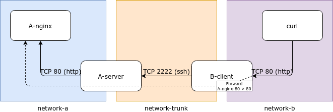

# Docker SSH Port Forward Server

Dockerized SSH server that only allows TCP local and remote port forwarding. Image based on `alpine:latest`.

**This image is experimental and might have undesirable effects. Use it under your responsability!**

## Getting started

Assuming you have a public key file `sshkey.pub` within the current working directory:

```bash
docker run -d --name=ssh-portforwarding-server -p 2222:2222 -v "$(pwd)/sshkey.pub:/ssh_pubkey:ro" davidlor/ssh-port-forward-server
```

Keep in mind that this image:

- Runs the SSH server in port `2222`
- Expects a public ssh key in container path `/ssh_pubkey`
- Does not allow root login; must use the `ssh` user to connect
- Does not allow interactive/shell connections (use the `-N` modifier on the ssh client)

## Example



```bash
# Create public & private keys
ssh-keygen -f ./sshkey -q -N ""

# Create networks
docker network create ssh-portforwarding-network-a
docker network create ssh-portforwarding-network-b
docker network create ssh-portforwarding-network-trunk

# Create SSH Server container
docker run -d --name=ssh-portforwarding-A-server \
    --network=ssh-portforwarding-network-trunk \
    -v "$(pwd)/sshkey.pub:/ssh_pubkey:ro" \
    davidlor/ssh-port-forward-server
docker network connect ssh-portforwarding-network-a ssh-portforwarding-A-server

# Create Nginx Server container
docker run -d --name=ssh-portforwarding-A-nginx \
    --network=ssh-portforwarding-network-a \
    nginxdemos/hello

# Create SSH Client container
docker run -d --name=ssh-portforwarding-B-client \
    --network=ssh-portforwarding-network-trunk \
    -e MAPPINGS="80:ssh-portforwarding-A-nginx:80" \
    -e "SSH_HOST=ssh-portforwarding-A-server" \
    -e "SSH_PORT=2222" \
    -e "SSH_USER=ssh" \
    -v "$(pwd)/sshkey:/ssh_key:ro" \
    davidlor/ssh-port-forward-client
docker network connect ssh-portforwarding-network-b ssh-portforwarding-B-client

# Run HTTP Client container
docker run --rm --network=ssh-portforwarding-network-b curlimages/curl \
    curl http://ssh-portforwarding-B-client:80
# If everything worked, you should be able to see some HTML

# Teardown all
docker stop ssh-portforwarding-B-client ssh-portforwarding-A-nginx ssh-portforwarding-A-server
docker rm ssh-portforwarding-B-client ssh-portforwarding-A-nginx ssh-portforwarding-A-server
docker network rm ssh-portforwarding-network-a ssh-portforwarding-network-b ssh-portforwarding-network-trunk
```

If you want to connect locally, without a Docker client container:

```bash
ssh -N -L <local port>:<target host>:<target port> ssh@<ssh server host> -p 2222
```

## Changelog

- 0.0.1
    - Initial release: functional local/remote port forwarding through the SSH server

## TODO

- Allow providing ssh public key/s through environment variable
- Allow enabling/disabling local/remote port forwarding through environment variables
